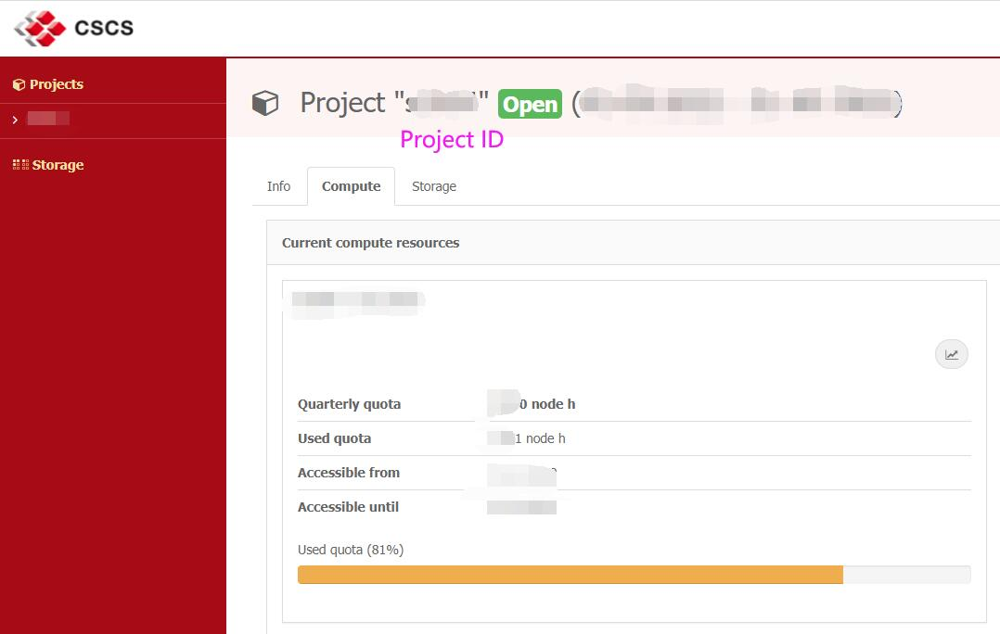
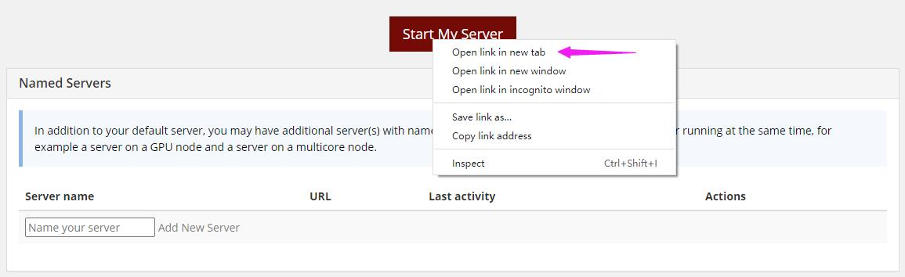
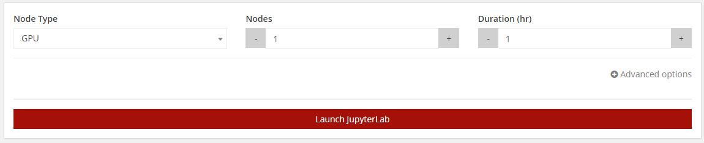
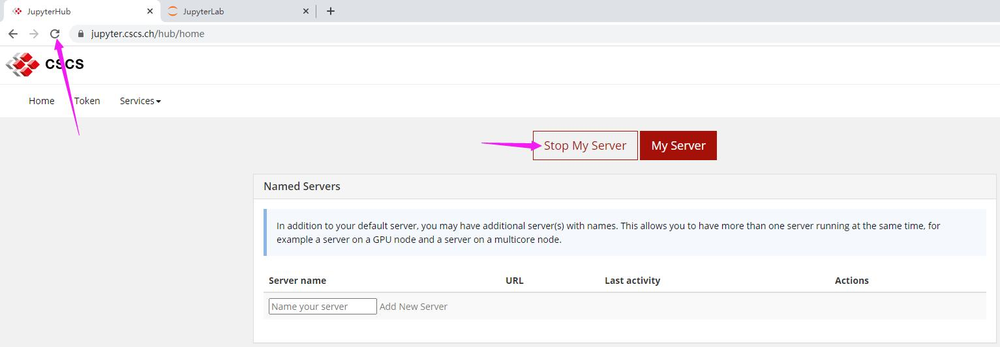
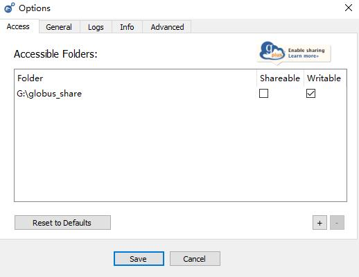

# CSCS

- [Before Usage](#before-usage )
- [Interactive Usage](#interactive-usage)
- [Common Commands](#common-commands)
- [PyTorch Job Script Example](#pytorch-job-script-example)
- [Horovod Gloo](#horovod_gloo)
- [Spark](#spark)
- [TensorFlow](#tensorflow)
- [Dataset and Transfer files](#dataset-and-transfer-files)
- [Large Scale Experiment](#large-scale-experiment)
- [DALI](#dali)
- [Question Ticket](#question-ticket)

## Before Usage

**Get Your Account**

1. Request the Prof invites you to current CSCS project (each project can only has a very limited members)
2. Waiting for CSCS administrator approval
3. Receive invitation e-mail and provide your personal information (need your passport pdf)
4. Waiting for CSCS administrator approval again
5. Receive account e-mail with password

According to [CSCS User Regulations](https://www.cscs.ch/services/user-regulations/), **CSCS does not allow sharing of accounts and the applicant will be immediately barred from all present and future use of CSCS facilities and is fully liable for all consequences arising from the infraction if such activity occur**.

**Connect the System**

ssh ela.cscs.ch

Here just the front end of the system, you cannot access the $SCRATCH file system and submit jobs. Then,

ssh daint.cscs.ch

You can access the $SCRATCH file system and submit jobs from here. Cannot connect daint directly before connecting ela.

**Check Project Status**

You can go to [https://account.cscs.ch](https://account.cscs.ch/) to check the <project ID> and remain quota hours, as shown below



The quota here is the whole lab quota rather than your current account, so the resources is very limited, please be careful and economical. One node h means occupy one node (1 P100 GPU) one hour, so we need balance the job walltime and requested resources. In my test, train ImageNet-1k using PyTorch with 90 epochs need about two or three hundreds node h at a time.

## Interactive Usage

**Interactive Usage**

For interactive usage to debug, unlike other cluster using command, You can access computing resources via your browser through a user interface based on Jupyter.

1. Login at https://jupyter.cscs.ch/hub/home

2. Right click 'Start My Server' and select 'Open link in new tab' 

   

3. Select nodes and duration you need.

   Each node has only one P100 GPU, and request 4 or more nodes here often fail, please consider use job.slurm for large test.

   

4. Cancel interactive resources usage

   Directly close the JupyterLab will **not** stop the job, it is still consuming resources in the background.

   Click the refresh button in the upper left corner of the previous page, then you can see the 'Stop My Server'. Click it and refresh again, if it shows as step 2, the job has been successfully terminated.

   

**Build Conda Environment**

After entering JupyterLab, you can build your conda environment just as how you do in other Linux system, such as using miniconda.

Most environments, such as  PyTorch, TensorFlow and Spark, etc. can be directly load using modules, you just need other packages in conda if they are not in modules.

## Common Commands

```shell
# To directory $SCRATCH.
# put and run all jobs related files in $SCRATCH system. 
cd $SCRATCH

# submit a job script
sbatch /PATH/TO/job.slurm

# check your job status
squeue -u your_account

# scancel your job
scancel job_ID

# view loaded module
# module related commands need at computing node
module list

# view avail module
module available

# load CUDA
module load daint-gpu

# active your conda environment
. /users/your_account/miniconda3/bin/activate your_env_name

# run your code
# don't need to select how many nodes or GPUs, default use all available resources that you requested.
srun python your_file.py
```

For more detailed information, please refer to [CSCS User Guide](https://user.cscs.ch/access/running/).

According to [CSCS Regulations](https://user.cscs.ch/access/running/#slurm-best-practices-on-cscs-cray-systems),  **Users are not supposed to submit arbitrary amounts of Slurm jobs and commands at the same time**. 

**It is possible to manually check the output file or log generated from your code or job, and in general, they actually has been finished for a while before the Slurm job finished. So you can cancel the Slurm job in advance manually, which means you can save time waiting for the Slurm job start and finish (because request less walltime)  and save our computing resources, especially when you use a lot nodes to parallel.** At least it was so when I tested PyTorch and Spark.

## PyTorch Job Script Example

```
#!/bin/bash -l

#SBATCH --job-name=my_cscs_job
#SBATCH --time=00:10:00
#SBATCH --nodes=2
#SBATCH --ntasks-per-core=1
#SBATCH --ntasks-per-node=1
#SBATCH --cpus-per-task=12
#SBATCH --constraint=gpu
#SBATCH --account=<project>

module load daint-gpu
module load PyTorch

export OMP_NUM_THREADS=$SLURM_CPUS_PER_TASK

# Environment variables needed by the NCCL backend
export NCCL_DEBUG=INFO
export NCCL_IB_HCA=ipogif0
export NCCL_IB_CUDA_SUPPORT=1

. /users/your_account/miniconda3/bin/activate your_env_name

cd your_code_path

srun \
python -u your_code.py  \
--epochs 90 \
--model resnet50 \
> ${SLURM_JOBID}.out 2> ${SLURM_JOBID}.err
```

Number of nodes define by --nodes, and each node only has one P100 GPU. 

We can noly use the 'normal' queue, because the project is too small and this kind of projects are not entitled to use the "low' queue. So once we have used our quarterly allocation we can only wait until the next allocation period to start.

CSCS also provides a general PyTorch guide at https://user.cscs.ch/computing/data_science/pytorch/, but some content maybe not works at least when I tested.

**Default PyTorch dataloader does not work if you use Horovod for distribution** (maybe because the specific MPI), please **use torch.distributed, Horovod Gloo, or Horovod + DALI** (please refer to DALI or Horovod Gloo section).

## Horovod Gloo

```
#!/bin/bash -l

#SBATCH --job-name=gloo-eb
#SBATCH --time=00:30:00
#SBATCH --nodes=4
#SBATCH --ntasks-per-node=1
#SBATCH --constraint=gpu
#SBATCH --account=<project>
#SBATCH --output=test_pt_hvd_%j.out

module load daint-gpu PyTorch

. /users/lyongbin/miniconda3/bin/activate your_env_name

export PMI_NO_PREINITIALIZE=1  # avoid warnings on fork
# unset CSCS_CUSTOM_ENV PELOCAL_PRGENV PROFILEREAD RCLOCAL_PRGENV RCLOCAL_BASEOPTS

for node in $(scontrol show hostnames); do
   HOSTS="$HOSTS$node:$SLURM_NTASKS_PER_NODE,"
done
HOSTS=${HOSTS%?}  # trim trailing comma
echo HOSTS $HOSTS

horovodrun -np $SLURM_NTASKS -H $HOSTS --gloo --network-interface ipogif0 \
   --start-timeout 120 --gloo-timeout-seconds 120 \
python -u your_code.py  \
--epochs 90 \
--model resnet50
```

Horovod Gloo works without using MPI, so you can use default PyTorch dataloader as on other clusters.

## Spark

Please refer to https://user.cscs.ch/computing/data_science/spark/, it looks like they have fixed the bugs here I encountered before.

Please note that the example in above link use CPU nodes, while our project only can access GPU nodes when I used, so we need appropriate modify it, such as SPARK_WORKER_CORES=12 and module load.

In the example, the version number of spark-examples_2.11-2.4.7.jar maybe inappropriate. If you meet 'ERROR: file doesn't exist' , please use ‘module available’ to check the Spark location, and go to that path to find the right jar name.

When generate yourself jar, please do not include packages in your local environment into the jar file.

They also don't have HDFS on Piz Daint, we need put our data directly on $SCRATCH file system.

## TensorFlow

Please refer to https://user.cscs.ch/computing/data_science/tensorflow/, I have test the examples here.

## Dataset and Transfer files

**Dataset**

Each user only has 1M files quota on Piz Daint $SCRATCH, users with over 1 million files and folders will be warned at submit time and will not be able to submit new jobs. 

So for large dataset like ImageNet-1K (ILSVRC2012), which has about 1.4M, we cannot use it as what we do in other cluster. Although the administrator temporarily raised the limit of another member, I was denied when I requested the same operation : (

You can access the ImageNet-1K (ILSVRC2012) at following path temporarily:

```shell
--train-dir /scratch/snx3000/hliu/imagenet/train 
--val-dir /scratch/snx3000/hliu/imagenet/val
```

The long-term method is to use NVIDIA DALI with TFRecord, please refer to DALI section.

If you need use other large dataset has more than 1M files, you need to convert them to TFRecord or LMDB format to reduce the number of files occupied, which maybe need use the appropriate dataloader when use them.

**Transfer files**

Unlike other cluster where we can use scp command, FileZilla or WinSCP, on CSCS, we cannot connect the daint.cscs.ch $SCRATCH file system directly. 

You can use first transfer them to $HOME, then cp them to \$SCRATCH, or use git clone.

**If you use your own personal account**( login need google account and it's pretty wired if one CSCS account use multiple google account at different IP), a better way is to use globus to transfer files, which actually works like FileZilla or WinSCP and can connect the daint.cscs.ch $SCRATCH file system directly. Please refer to https://user.cscs.ch/storage/transfer/external/

You need install the globus personal client on your local machine and set visible path.




## DALI

NVIDIA DALI can accelerate data loading and pre-processing using GPU rather than CPU, although with GPU memory tradeoff. 

It can also avoid some potential conflicts between MPI libraries and Horovod on some GPU clusters.  

**Install**

```shell
module load daint-gpu PyTorch
. /users/your_account/miniconda3/bin/activate your_env_name
pip install tensorboard tqdm
pip install --extra-index-url https://developer.download.nvidia.com/compute/redist --upgrade nvidia-dali-cuda110
```

**Usage**

You need replace default PyTorch dataloader with dali_dataloader, I provide a PyTorch DALI example using ImageNet-1k at [here](https://github.com/NUS-HPC-AI-Lab/LARS-ImageNet-PyTorch).

DALI requires data in *TFRecord format* in the following structure:

```
train-recs 'path/train/*' 
val-recs 'path/validation/*' 
train-idx 'path/idx_files/train/*' 
val-idx 'path/idx_files/validation/*' 
```

On CSCS, if you want use ImageNet-1k TFRecord data, you can directly use data-dir=/scratch/snx3000/datasets/imagenet/ILSVRC2012_1k/

About the parameters on DALI:

- *prefetch_queue_depth* and *num_threads*  might also be something to explore, as it can speed up your loading a lot, with some memory tradeoff.
- *last_batch_policy*  you probably want PARTIAL on validation, and DROP during training: https://docs.nvidia.com/deeplearning/dali/user-guide/docs/plugins/pytorch_plugin_api.html?highlight=last_batch_policy, just as I set in above example link.
- *device*  Above example link use device="mixed/gpu", for ImageNet-1k and GPU with 16GB, default PyTorch dataloader allows batchsize 128, while DALI can only use batchsize 64. If you set device="mixed/gpu" to "cpu", it won't need extra GPU memory, however copying directly to gpu makes the loading much faster.

## Question Ticket

If you have some specific question, you can sent a question ticket to the CSCS staff. (Do not send an email to them, although CSCS User Guide said so, the e-mail method has actually been discarded.)

Go to https://jira.cscs.ch/plugins/servlet/desk/site/global , click 'Generic request' under 'Open a case', describe the problem you encountered and reelevated code and log files location. The staff will answer it soon on at working hours on European working days.